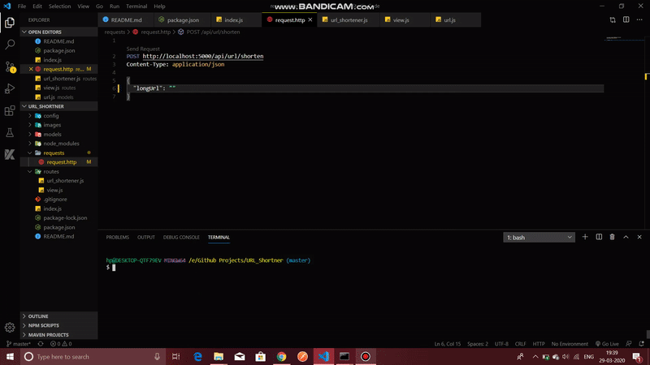

# URL_Shortener

The main objective of this project idea is to shorten URLs.

## Usage

 The main task the application will accomplish is to shorten URLs and then redirect users to the original URL when the shortened URL is visited.. By this:-

1. They make links more manageable.
2. They can track and compile click data.
3. They promote sharing.

Since users will visit the shortened URL days, months, or even years after, we are saving the original and shortened URLs in a database. When a request comes in, the application checks if the URL exists and redirects to the original, or else it redirects to a 404 page.

## Dependencies 

1. NODE JS
2. MONGO DB
3. EXPRESS

### To Run
```
First Clone the project.

npm install

Then type npm run dev in the terminal,and side by side switch on the Mongo DB Compass server.

Then the nodemon server will start. Yahoo..!!!

Then go to the requests folder, and you have to click on the post request button by copying your url you want to shorten in the longUrl portion.
```

### Demo
<!-- 
<center>

</center> -->

### Author 
```
Rahul Kumar Patro
```